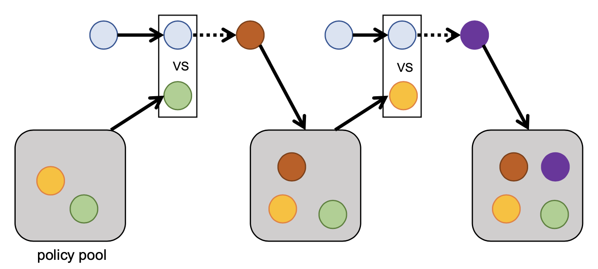
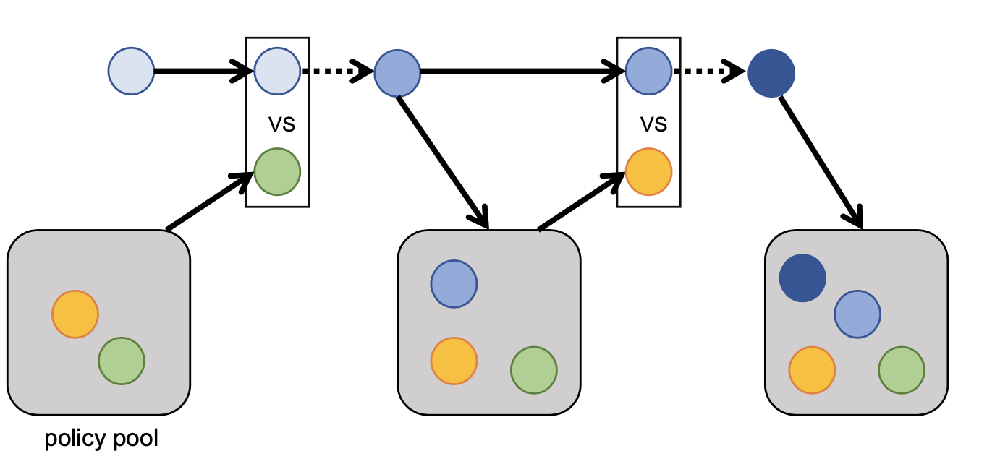

Competitive Learning --- PBT
======================================================================

.. contents::
    :local:
    :depth: 2

----------------------

To achieve stronger and less exploitable policies, we embrace competitive learning as a general approach. Different from purely cooperative learning
which we defined previously as best responding to a fixed opponent under a pre-defined scenario, we want to acquire stronger skills in football by competing
with changing opponent for better generalization. Our framework is designed to seamlessly accommodate various self-play methods, including Naive Self-Play (SP),
Fictitious Self-Play (FSP), Policy Space Response Oracle (PSRO), and even League Training. By offering such flexibility, we enable researchers to explore and utilize
the most suitable self-play method for their specific needs.

Policy-Space Response Oracle (PSRO)
---------------------------------------------------------

PSRO incorporates game-theoretical analysis into iterative computation of best responding (BR) policies. In our case, We will
have a *NxN* payoff matrix recording simulation results between policy pair, which is used to compute policy combinations at each PSRO iteration. Since
in GRF, playing from both sides are nearly identical. Thus, the payoff matrix should be symmetric. During each PSRO iteration, we start by computing the
the opponent policy combinations and then best responding to the combination using reinforcement learning approach. The resulting best response police will be
added to the population and the payoff matrix is expanded after simulation. The process iteration to look for empirically estimated Nash Equilibrium.

An depiction is as follows:

    A depiction of two PSRO iterations

In practice, since each BR poliy is hard to learn from scratch (random initialization), we inherit from previous BR policy to largely speed up the process:

    A depiction of two PSRO-with-inherit iterations

To run a PSRO example, execute the command:

.. code-block:: shell

    python3 light_malib/main_pb.py --config expr_configs/population_based_self_play/ippo_5v5_hard_psro.yaml

