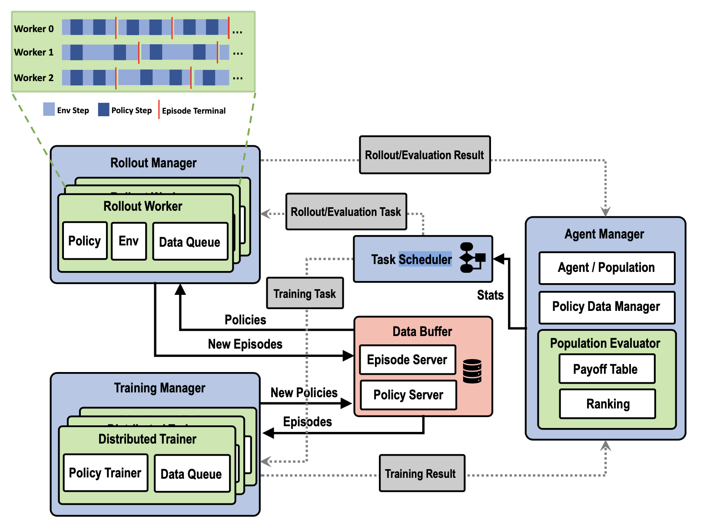

Framework Architecture
==============================

Here we introduce our framework architecture. The design draws great inspiration from `MALib <https://github.com/sjtu-marl/malib>`_
and `RLLib <https://github.com/ray-project/ray/tree/master/rllib>`_.

.. contents::
    :local:
    :depth: 2

Workflow
--------------------------

    Framework Workflow

The framework has five major components serving different roles. They are *Rollout Manager*, *Training Manager*, *Data Buffer*,
*Agent Manager* and *Task Scheduler*.

Components
--------------------------------------

Rollout Manager
^^^^^^^^^^^^^^^^^^^^^^^^^^^^^^
``light_malib/rollout/rollout_manager.py``

The Rollout Manager establishes multiple parallel rollout workers and
delegates rollout tasks to each worker. Each rollout task includes environment
settings, policy distributions for simulation, and information pertaining to the
Episode Server.

Training Manager
^^^^^^^^^^^^^^^^^^^^^^^^^^^^^^
``light_malib/training/training_manager.py``

The Training Manager sets up multiple distributed trainers and assigns training
tasks to each trainer. Training task descriptions consist of training configurations
and details regarding the Policy and Episode buffers.

Data Buffer
^^^^^^^^^^^^^^^^^^^^^^^^^^^^^^
``light_malib/buffer/``

The Data Buffer serves as a repository for episodes and policies. The Episode
Server saves new episodes submitted by the rollout workers, while trainers retrieve
sampled episodes from the Episode Server for training. The Policy Server, on the other
hand, stores updated policies submitted by the Training Manager. Rollout workers
subsequently fetch these updated policies from the Policy Server for simulation.

Agent Manager
^^^^^^^^^^^^^^^^^^^^^^^^^^^^^^
``light_malib/agent/agent_manager.py``

The Agent Manager manages a population of policies and their associated data, which
includes pairwise match results and individual rankings.

Task Scheduler
^^^^^^^^^^^^^^^^^^^^^^^^^^^^^^
``light_malib/framework/scheduler/``

The Task Scheduler is responsible for scheduling and assigning tasks to the
Training Manager and Rollout Manager. In each training generation, it selects an opponent distribution
based on computed statistics retrieved from the Agent Manager.

Population-based Training Workflow
^^^^^^^^^^^^^^^^^^^^^^^^^^^^^^
Beside training against a fixed opponent, Light-MALib also supports population-based training, such as the Policy-Space Response Oracle (PSRO).
An illustration of a PSRO trial is given as below:

.. figure:: ../images/psro.svg
    :align: center
    :width: 500
    :alt: workflow

    Illustration of a PSRO trial

#. The Evaluation Manager conducts simulations between each pair of policies in the current population. These simulations evaluate the performance of each policy against others, providing valuable information about their relative strengths.

#. The Policy Data Manager updates the payoff table based on the simulation results. The payoff table captures the performance metrics and outcomes of the policy interactions. Using this information, the manager computes the Nash equilibrium.

#. The Agent Manager records the simulation results and generates the Nash mixture distribution of opponent policies.

#. Training and rollout processes are executed according to the framework illustrated in Figure 12. The rollout process simulates matches between the policies, while the training process involves updating the policies using the collected data. This process is monitored and terminated by the Stopper component. The Prefetcher component preloads data to expedite the training process.

#. The trained policy for the current generation is stored in the population. The procedure then returns to step one, initiating the next generation of evaluation and training.

