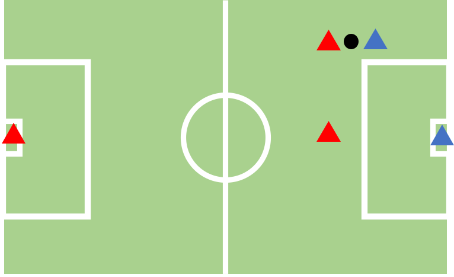
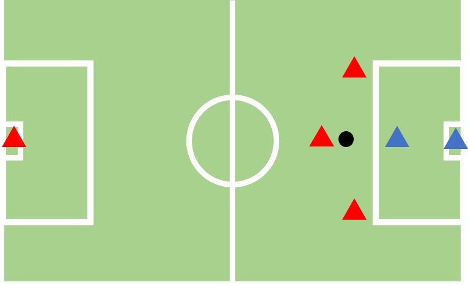
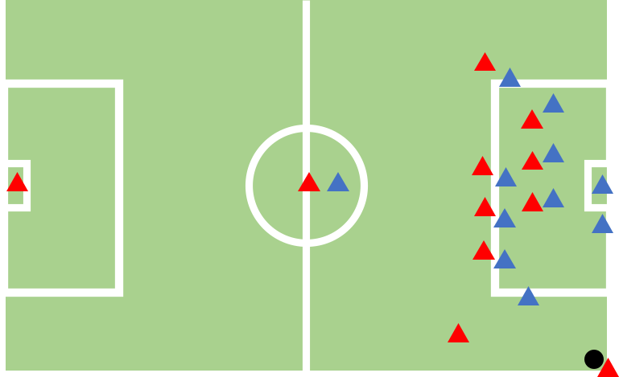
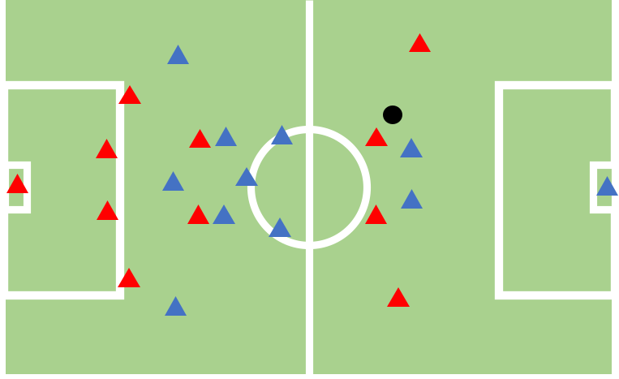
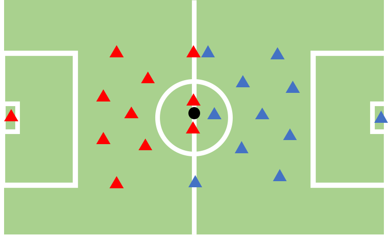

Scenarios
=====================================

.. contents::
    :local:
    :depth: 2

----------------------

Here we include our benchmark GRF multi-agent scenario description

.. contents::
    :local:
    :depth: 1

.. _GRF_intro

GRF intro
---------------------------
Google Research Football (GRF) is a football simulator with its dynamics engine implemented in C++ and API in Python. It emulates realistic soccer games
like FIFA and REAL Football, while allowing algorithms to control all players on the field. It places emphasis on high-level actions rather than low-level controls. GRF allows researchers to
build their own football scenarios by simply writing a scenario configuration file defining players and ball's position and game rules.

Scenario Description
---------------------------------

We establish standardized settings for both academy and full-game scenarios in the multi-agent context of Google Research Football and the detailed config files can be found in ``light_malib/envs/gr_football/scenarios/...``

Pass and shot with keeper
^^^^^^^^^^^^^^^^^^^^^^^^^

A 3 vs 2 academy game. Two left-team players start at the right half, competing against one
right-team defense player and the goalkeeper. The episode terminates when: a. reaches maximum
duration (400 steps); b. ball is out of bounds; c. one team scores; d. ball ownership changes.

.. list-table::
   :widths: 25 25
   :align: center
   :header-rows: 0

   * - ``Total Player Number``
     - 5
   * - ``Episode Length``
     - <=400
   * - ``Deterministic``
     - False
   * - ``Offsides``
     - False
   * - ``End Episode on Score``
     - True
   * - ``end_episode_on_out_of_play``
     - True
   * - ``end_episode_on_possession_change``
     - True
   * - ``Bot Level``
     - \-

.. _3v1:

3 vs 1 with keeper
^^^^^^^^^^^^^^^^^^^^^^^^^^^^

A 4 vs 2 academy game. Three left-team players start at the right half, competing against one
right-team defense player and the goalkeeper. The same termination condition applies as the pass
and shoot with keeper scenario.

.. list-table::
   :widths: 25 25
   :align: center
   :header-rows: 0

   * - ``Total Player Number``
     - 6
   * - ``Episode Length``
     - <=400
   * - ``Deterministic``
     - False
   * - ``Offsides``
     - False
   * - ``End Episode on Score``
     - True
   * - ``end_episode_on_out_of_play``
     - True
   * - ``end_episode_on_possession_change``
     - True
   * - ``Bot Level``
     - \-

.. _corner:

Corner
^^^^^^^^^^^^^^^^^^^^^^^^^^^^

An 11 vs 11 academy game. The left team starts the ball at the right team’s corner. The same
termination condition applies as the pass and shoot with keeper scenario.

.. list-table::
   :widths: 25 25
   :align: center
   :header-rows: 0

   * - ``Total Player Number``
     - 22
   * - ``Episode Length``
     - <=400
   * - ``Deterministic``
     - False
   * - ``Offsides``
     - False
   * - ``End Episode on Score``
     - True
   * - ``end_episode_on_out_of_play``
     - True
   * - ``end_episode_on_possession_change``
     - True
   * - ``Bot Level``
     - \-

.. _ct:

Counter attack
^^^^^^^^^^^^^^^^^^^^^^^^^^^^

 An 11 vs 11 academy game. Four left team players start the ball at the mid-field in the right
team’s half and only two right team players defend in their own half. The rest of the players are
at the left team’s half. The same termination condition applies as the pass and shoot with keeper scenario.

.. list-table::
   :widths: 25 25
   :align: center
   :header-rows: 0

   * - ``Total Player Number``
     - 22
   * - ``Episode Length``
     - <=400
   * - ``Deterministic``
     - False
   * - ``Offsides``
     - False
   * - ``End Episode on Score``
     - True
   * - ``end_episode_on_out_of_play``
     - True
   * - ``end_episode_on_possession_change``
     - True
   * - ``Bot Level``
     - \-

.. _5v5:

5 vs 5 full-game hard
^^^^^^^^^^^^^^^^^^^^^^^^^^^^

A 5 vs 5 full-game. Four players from each team gather at the center of the field.
The left-team starts the kick-off. The game terminates when the episode reaches the
maximum duration (3,000steps). The second half begins at the 1501st step and two teams
will swap sides.

.. figure:: ../images/5v5.svg
    :align: center
    :width: 200
    :alt: 5v5

.. list-table::
   :widths: 25 25
   :align: center
   :header-rows: 0

   * - ``Total Player Number``
     - 10
   * - ``Episode Length``
     - 3000
   * - ``Deterministic``
     - False
   * - ``Offsides``
     - True
   * - ``End Episode on Score``
     - False
   * - ``end_episode_on_out_of_play``
     - False
   * - ``end_episode_on_possession_change``
     - False
   * - ``Bot Level``
     - 1.0

.. _11v11:

11-vs-11 full-game hard
^^^^^^^^^^^^^^^^^^^^^^^^^^^^

An 11 vs 11 full-game. The left-team starts the kick-off. The game terminates when the episode reaches the maximum duration (3,000 steps).
The second half begins at the 1501st step and two teams will swap sides.

.. list-table::
   :widths: 25 25
   :align: center
   :header-rows: 0

   * - ``Total Player Number``
     - 22
   * - ``Episode Length``
     - 3000
   * - ``Deterministic``
     - False
   * - ``Offsides``
     - True
   * - ``End Episode on Score``
     - False
   * - ``end_episode_on_out_of_play``
     - False
   * - ``end_episode_on_possession_change``
     - False
   * - ``Bot Level``
     - 1.0

