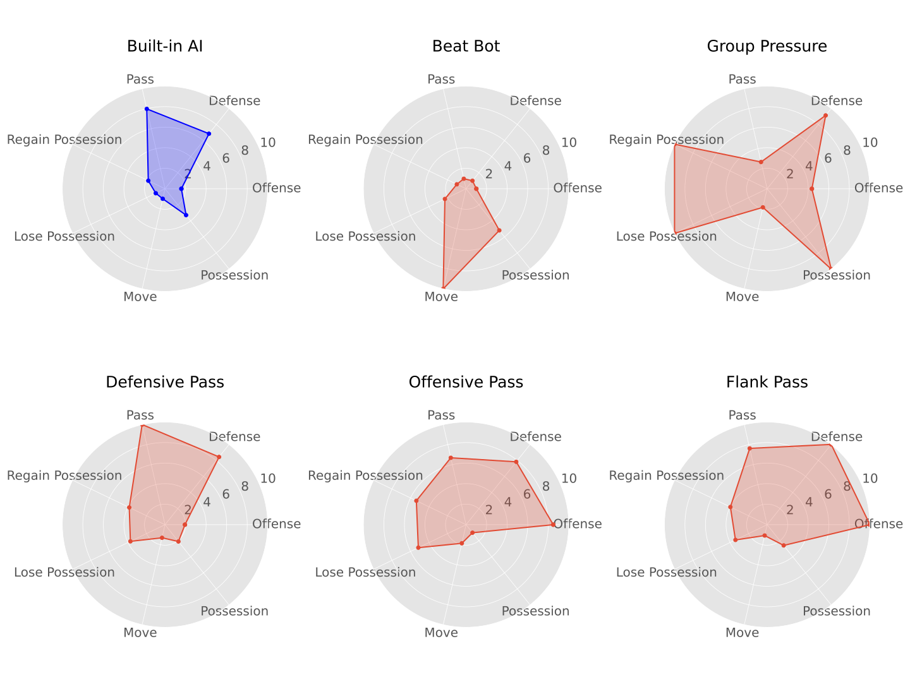

Pre-trained Policies
======================================================================

.. contents::
    :local:
    :depth: 3

----------------------

We release some research tools that we found very useful during our experiments on GRF. We wish the community can benefit from them
and continue their good works on MARL.

Potential Uses of Pre-trained GRF models
^^^^^^^^^^^^^^^^^^^^^^^^^^^^^^^^^^^^^^^^

Here we provide our pre-trained models on both 5-vs-5 and 11-vs-11 full-game multi-agent scenarios. These models can be found in path ``light_malib/trained_models/gr_football/``.
Each corresponding folder contains three files: the actor and the critic models (PyTorch) and the model description. These models are currently coupled with the framework and we will
describe how to use them for various purpose:

- **As a generally strong opponent to compete with.** And a specific opponent policy and encourage learning of counter-strategies.

**How to Use**: pre-trained models are ready for loading as long as you put their relative path in the ``population.init_policies`` section of a configuration ``.yaml`` file. For example, in
config file ``expr_configs/cooperative_MARL_benchmark/full_game/5_vs_5_hard/ippo.yaml``. The default setup for ``population.init_policies`` is shown as below:

.. code-block:: shell

     # In this setting, the agent 0 initialize randomly in the initial generation, whereas the
     # agent 1 initalize from pre-trained policiy built-in AI in the initial generation.
     # We train agent 0 by default and against built-in AI only for one generation, making it
     # a experiment config file for benchmarking 5-vs-5 full-game hard scenario.

     policy_init_cfg:
        agent_0:                                # agent_id
          new_policy_ctr_start: -1
          init_cfg:
            - condition: "==0"                  # initialization in initial generation
              strategy: random                  # now support pretrained, inherit_last, random
              policy_id:
              policy_dir:
          initial_policies:

        agent_1:
          new_policy_ctr_start: -1
          init_cfg:
            - condition: "==0"                  # condition if True in order
              strategy: pretrained              # now support pretrained, inherit_last, random
              policy_id: built_in
              policy_dir: light_malib/trained_models/gr_football/5_vs_5/built_in
          initial_policies:                     #initial population

The path for ``built_in`` policy in ``agent_1`` can be changed to other pre-trained policies if you want to best response to different strategies.

- As a good model initialization to continue training on, largely saving skills learning time. Initializing from a pre-trained policy can inherit its style-of-play as well.

**How to Use:** similar to previous one, we can switch the tag ``strategy: random`` in ``agent_0`` to ``strategy: pre-trained`` and specify policy name and path in ``policy_id`` and
``policy_dir``.

- As a quality data generator which yields data with good exploration;

**How to Use**: this involve using the `light_malib/algorithm/bc` algorithm to train a behaviour cloning policy.

5-vs-5 Radar Plots
^^^^^^^^^^^^^^^^^^^^^^

.. figure:: ../images/radar_5v5.svg
    :align: center
    :width: 400
    :alt: psro img

    5-vs-5 pre-trained policies

To give a comprehensive understanding of these pre-trained policies. We gather them together and do massive amount of simulations. We collect each piece of football statistics and rank the pre-trained policies using
radar plot. The statistics are *Offense, Defense, Possession, Move, Lose Possession, Regain Possession* and *Pass*.

11-vs-11 Radar Plots
^^^^^^^^^^^^^^^^^^^^^^

    11-vs-11 pre-trained policies
