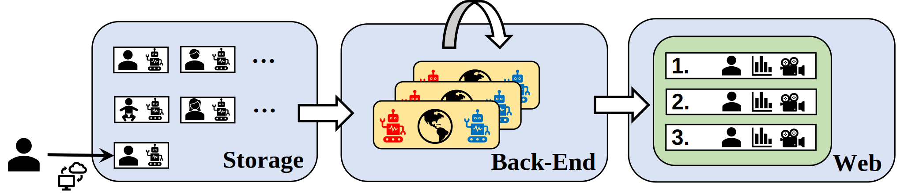
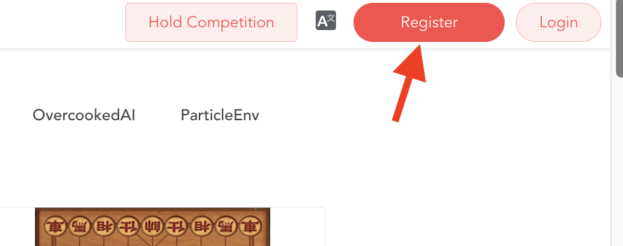
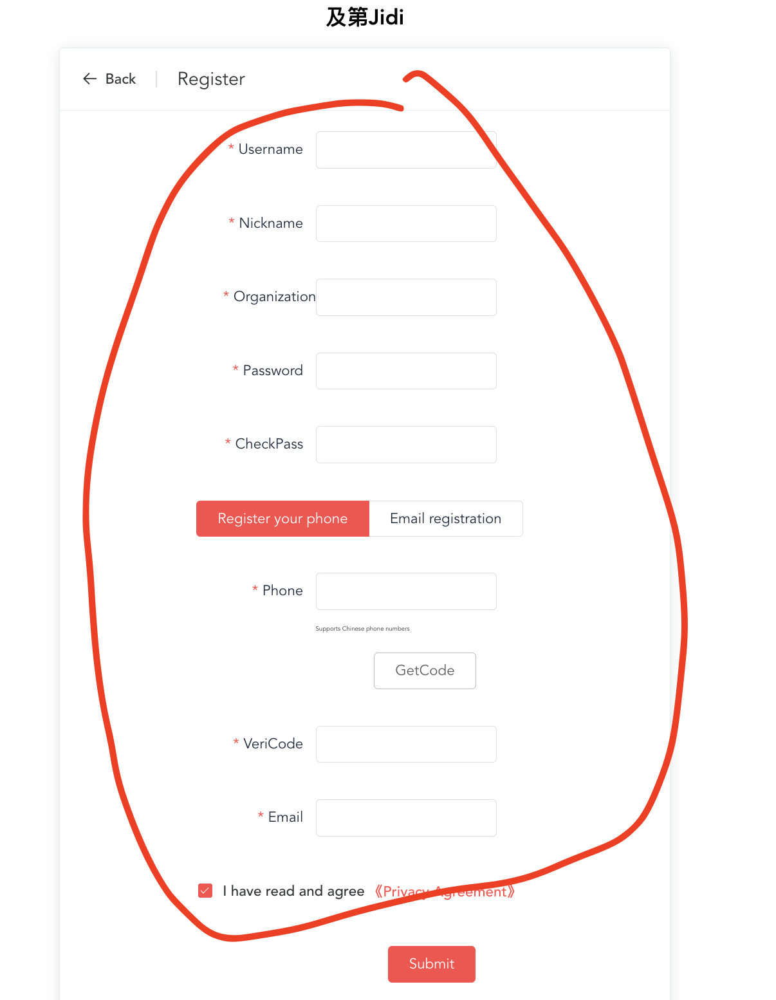
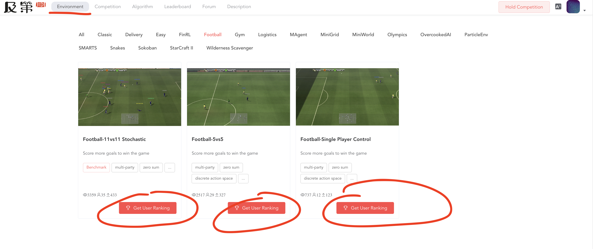
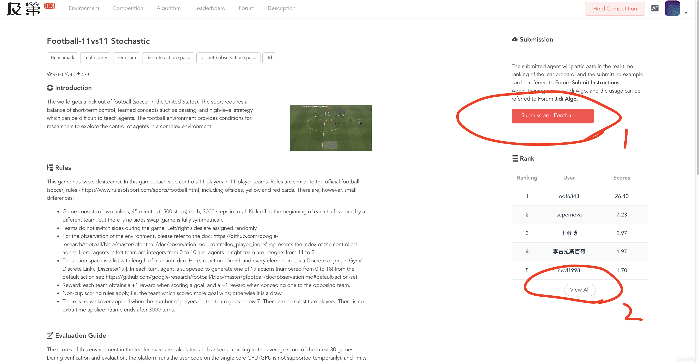
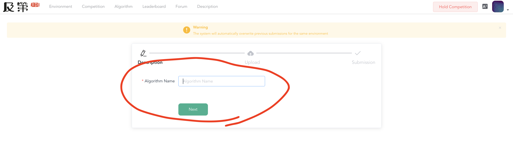
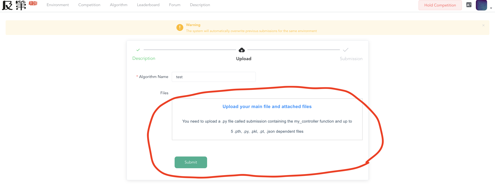
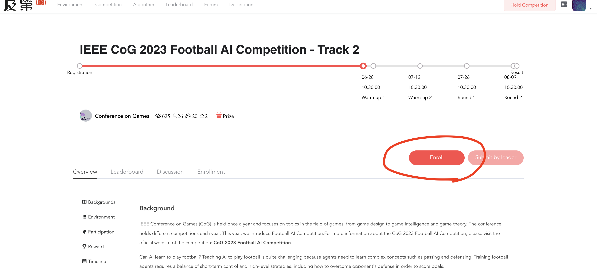
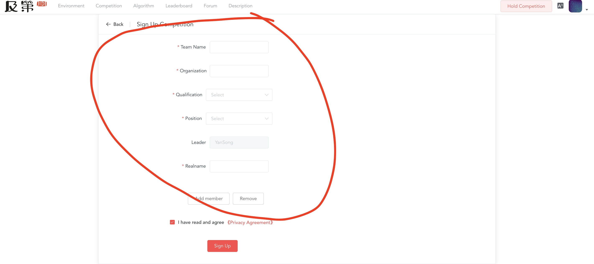

Online Ranking
======================================================================

.. contents::
    :local:
    :depth: 2

----------------------

We build Online GRF Ranking to better evaluate football AI by incorporating contributions from the community. We invite participants to register on our
online evaluation platform `JIDI <http://www.jidiai.cn/environment>`_ and submit their GRF agents on our `Daily Evaluation <http://www.jidiai.cn/env_detail?envid=34>`_ section or
participate the `Competition Evaluation <http://www.jidiai.cn/compete_detail?compete=35>`_.

JIDI Intro
^^^^^^^^^^^^^^^^^^^^^^^^^^^^^^^^^^^^^^^^^^^^^^^^^^^^^^^^^^^^^^^^^^^^^
JIDI gets its name from a Chinese word **及第 (jí dì)** which refers to *Passing an imperial examination in ancient China*. JIDI aims to address the lack of public
leaderboards in the field of decision-making AI by providing **online evaluation** and **ranking** services for a wide range of reinforcement learning environments.
Currently, JIDI supports nearly 100 environments, encompassing both single-agent games like classic-control games in the *gym* framework, as well as multi-agent
games such as Texas Hold’em and Google Research Football. The online ranking system allows agents to compete against unseen opponents, which is crucial for studying
generalization ability, an important aspect of algorithm emphasized by many works.

The mechanism behind JIDI is illustrated below. When an user submits his customized decision-making agent
to the agent storage, the back-end evaluation process executes parallel evaluation tasks distributedly
on computing nodes. The evaluation results are updated to the user’s score and the online ranking is
updated accordingly. Users can view replays of their matches.

    JIDI Online Ranking System

JIDI offers two types of evaluation: **Daily Evaluation** and **Competition Evaluation**.

Daily Evaluation
^^^^^^^^^^^^^^^^^^^^^^^^^^^^^^^^^^^^^^^^^^^^^^^^^^^^^^^^^^^^^^^^^^^^^^
In Daily Evaluation (`Link <http://www.jidiai.cn/env_detail?envid=34>`_), users can submit their agents at any time, triggering the background evaluation processes. This
allows for continuous assessment and ranking of agents based on their performance. JIDI provide Daily Evaluation on three GRF full-game scenarios:

#. `Single-agent 11-vs-11 <http://www.jidiai.cn/env_detail?envid=14>`_
#. `Multi-agent 5-vs-5 <http://www.jidiai.cn/env_detail?envid=71>`_
#. `Multi-agent 11-vs-11 <http://www.jidiai.cn/env_detail?envid=34>`_

Competition Evaluation
^^^^^^^^^^^^^^^^^^^^^^^^^^^^^^^^^^^^^^^^^^^^^^^^^^^^^^^^^^^^^^^^^^^^^^^^
Competition Evaluation (`Link <http://www.jidiai.cn/compete_detail?compete=36>`_) usually associates with academic conferences or university coursework. The background
evaluation processes are initiated once the deadline is reached. JIDI has previously held a GRF online competition on two tracks:

#. `CoG 2022 Football AI Competition --- 5-vs-5 full-game Track <http://www.jidiai.cn/compete_detail?compete=15>`_
#. `CoG 2022 Football AI Competition --- 11-vs-11 full-game Track <http://www.jidiai.cn/compete_detail?compete=16>`_

and is holding the same competition this year:

#. `CoG 2023 Football AI Competition --- 5-vs-5 full-game Track <http://www.jidiai.cn/compete_detail?compete=35>`_
#. `CoG 2023 Football AI Competition --- 11-vs-11 full-game Track <http://www.jidiai.cn/compete_detail?compete=36>`_

**Feel free to participant and hope you have fun !** (`competition description link <http://www.jidiai.cn/cog_2023/>`_)

Tutorial
^^^^^^^^^^^^^^^^^^^^^^^^^^^^^^^^^^^^^^

**1. Register an account on JIDI platform**

    Step one: register an account

**2. Fill in the form**

    Step two: fill in the form

**3. Enter the Google Research Football Daily Evaluation page**

    Step three: GRF Daily Evaluation

**4. Upload your agents (1) or view the ranking (2)**

    Step four: submission and ranking

**5. Uploading**

    Step five: fill in the form

**6. register for the competition**

.. figure:: ../images/jidi_tutorial/step7.png
    :align: center
    :width: 800
    :alt: step1

    Step six: register for the competition